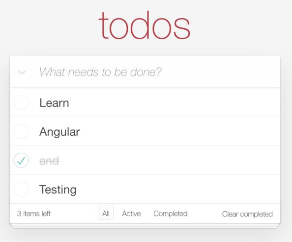

# TodoMVC built with Angular and NgRx

The well-known TodoMVC built with Angular and NgRx in a structured and testable way.

[Edit and try it out online](https://codesandbox.io/s/github/blacksonic/todomvc-angular)

## Concepts and tools covered

- [Angular CLI](https://cli.angular.io/)
- [Component Interactions](https://angular.io/guide/component-interaction)
- [NgRx](https://ngrx.io/)

## Usage

After installing the dependencies the following NPM scripts become available:

- `start`: starts the application in development mode on [http://localhost:9100](http://localhost:9100)
- `build`: bundles the application for production into the `dist` folder
- `test`: runs unit and E2E tests
- `test:unit`: runs unit tests with [Karma](https://karma-runner.github.io/) and [Jasmine](https://jasmine.github.io/) in the `src` folder suffixed with `*.spec.ts`
- `test:e2e`: runs E2E tests with [Protractor](https://www.protractortest.org/) in the `e2e/src` folder suffixed with `*.spec.ts`
- `format`: formats the code with [Prettier](https://prettier.io/) within the `src` folder
- `lint`: lint files with [TSLint](https://palantir.github.io/tslint/) based on [Codelyzer](http://codelyzer.com/) and the Prettier config

## Component architecture

Application is compatible with [Augury devtools](https://chrome.google.com/webstore/detail/augury/elgalmkoelokbchhkhacckoklkejnhcd?hl=en) 
and [Redux devtools](https://chrome.google.com/webstore/detail/redux-devtools/lmhkpmbekcpmknklioeibfkpmmfibljd?hl=en)

## Series

This implementation is part of a series where the same application was implemented with the same architecture.

- [Vue](https://github.com/blacksonic/todomvc-vue)
- [Vue Composition API](https://github.com/blacksonic/todomvc-vue-composition-api)
- [Angular](https://github.com/blacksonic/todomvc-angular)
- [React](https://github.com/blacksonic/todomvc-react)
- [React Hooks](https://github.com/blacksonic/todomvc-react-hooks)
- [Svelte](https://github.com/blacksonic/todomvc-svelte)
